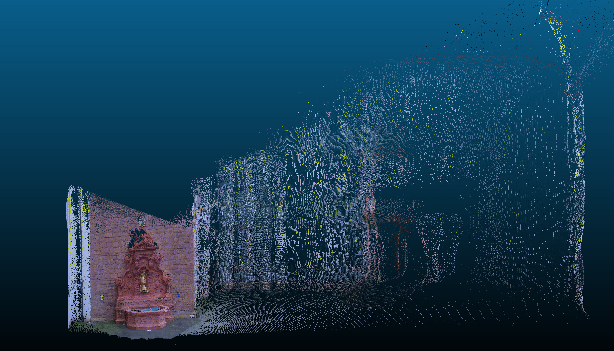

# VGGT C++ Inference (TensorRT + LibTorch)

## Abstract

This repository presents a C++ inference pipeline for an ONNX-converted VGGT model, implemented with TensorRT for accelerated execution and LibTorch for tensor-level data handling. The system produces dense depth predictions and reconstructs a colored 3D point cloud in PCD format.

## Method Overview

The pipeline follows four stages:

1. Multi-view RGB images are loaded and normalized.
2. Inputs are resized to `518 x 518` and passed to the TensorRT engine.
3. Model outputs (`depth`, `world_points`, `world_points_conf`, `images`) are post-processed.
4. Depth maps are exported as PNG, and a confidence-filtered RGB point cloud is exported as PCD.

## Requirements

- CUDA `12.8`
- TensorRT `10.x` (CUDA 12.0-12.9 compatible build)
- LibTorch with CUDA `12.8`
- CMake `3.20+`
- Visual Studio 2019+ (Windows)

## Model Source

The ONNX model is obtained from:

- https://github.com/akretz/vggt-onnx

## Build

Verify environment-specific paths in `CMakeLists.txt`:

- `Torch_ROOT`
- `TensorRT_DIR`

```bash
cmake -S . -B build
cmake --build build --config Release
```

## Execution

The current example uses images from `dataset/fountain-p11`.

```bash
.\build\Release\vggt_cpp_infer.exe
```

## Outputs

Generated artifacts are written to `dataset/fountain-p11/output`:

- `depth_*.png`
- `point_cloud_rgb.pcd`
- `pcd_result.png` (2D rendering of the reconstructed point cloud)

## Qualitative Results

### Depth Prediction


### Reconstructed Point Cloud (RGB)



## Notes

- Input images are collected automatically by extension: `.jpg`, `.jpeg`, `.png`, `.bmp`, `.webp`.
- Point cloud export filters points with `world_points_conf < 0.5` by default.
